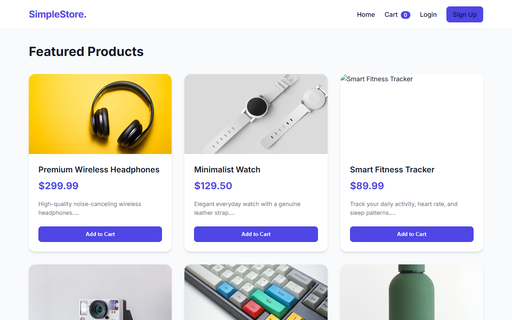
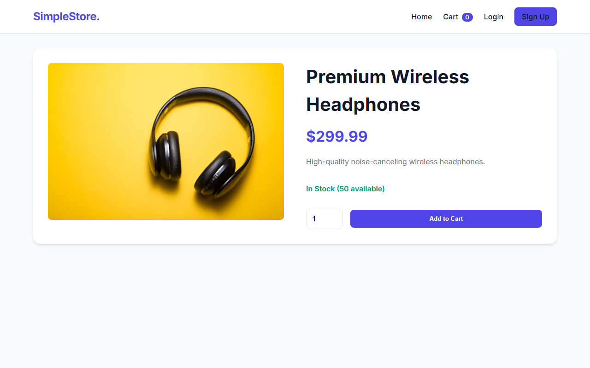
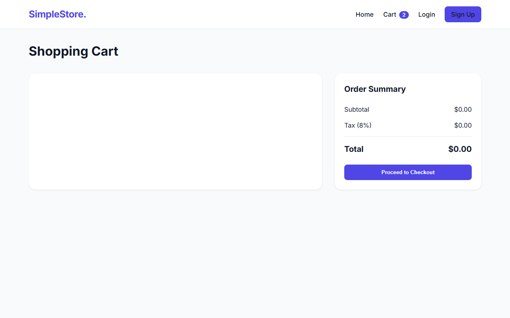
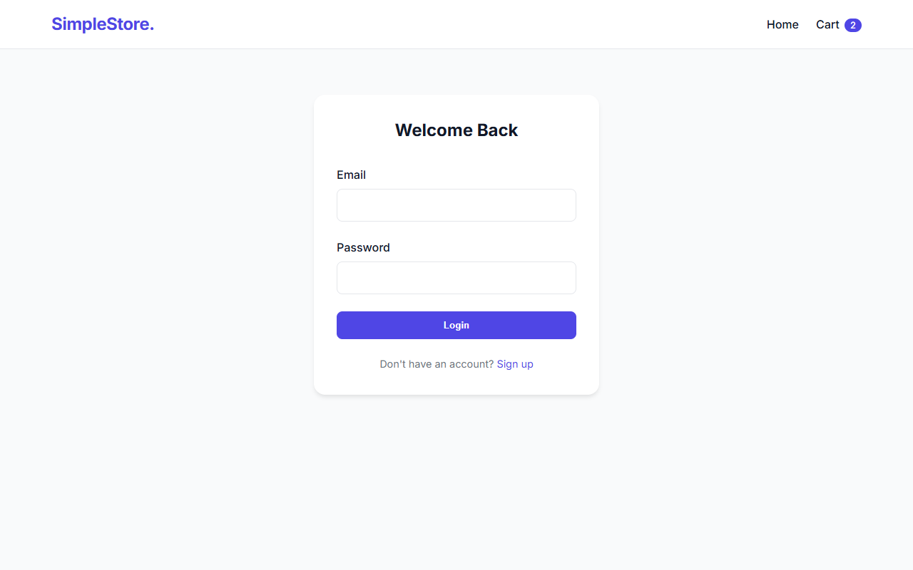

# 🛍️ Simple E-commerce Store



A modern, responsive, full-stack E-commerce web application built from scratch without any frontend frameworks. This project demonstrates a complete shopping flow, including user authentication, product catalogs, cart management, and order processing.

---

## ✨ Key Features

- **User Authentication (JWT):** Secure registration and login flows.
- **Product Catalog:** Responsive CSS-grid layout displaying all available items.
- **Dynamic Cart Management:** LocalStorage-based cart that handles quantity updates and calculates tax/subtotals.
- **Order Processing:** Secure backend endpoint that processes checkouts for authenticated users and stores orders in the database.
- **No Frontend Frameworks:** Pure Vanilla HTML, CSS, and JavaScript, styled with a modern glass/card aesthetic and custom CSS variables.
- **Zero-Config Database:** Uses SQLite to store users, products, orders, and order items. Automatically seeds dummy products on first run!

---

## 📸 Screenshots

### 🏠 Home Page


### 📦 Product Details


### 🛒 Shopping Cart


### 🔐 User Login


---

## 🛠️ Tech Stack

- **Frontend:** Vanilla HTML5, CSS3, ES6 JavaScript
- **Backend:** Node.js, Express.js
- **Database:** SQLite3
- **Security:** bcryptjs (password hashing), jsonwebtoken (JWT auth)

---

## 🚀 Getting Started

### Prerequisites
- [Node.js](https://nodejs.org/) installed on your machine.

### Installation

1. **Clone the repository:**
   ```bash
   git clone https://github.com/karmaboy1309/CodeAlpha_Simple-E-commerce-Store.git
   cd CodeAlpha_Simple-E-commerce-Store
   ```

2. **Install dependencies:**
   ```bash
   npm install
   ```

3. **Start the server:**
   ```bash
   npm start
   ```
   *The database (`database.sqlite`) will automatically be created and seeded with sample products.*

4. **Open the app:**
   Navigate to [http://localhost:3000](http://localhost:3000) in your browser.

---

## 📁 Project Structure

```text
├── public/                 # Frontend Static Files
│   ├── css/style.css       # Global styles & responsive grid
│   ├── js/main.js          # Shared cart & auth utilities
│   ├── index.html          # Product listing
│   ├── product.html        # Individual product view
│   ├── cart.html           # Cart & checkout page
│   ├── login.html          # Login form
│   └── register.html       # Registration form
├── server/                 # Backend Node.js Files
│   ├── database.js         # SQLite connection & schema initialization
│   └── server.js           # Express API and JWT auth routes
├── screenshots/            # Project showcase images
└── package.json            # Dependencies
```

---

## 📝 Changelog

- **Fix:** Corrected broken Unsplash image URL for the Smart Fitness Tracker.
- **Fix:** Resolved template literal escaping issue in the shopping cart logic, restoring full cart functionality.
- **Chore:** Removed `package-lock.json` for a cleaner repository structure.

---

*Built with ❤️ for the CodeAlpha Internship.*
